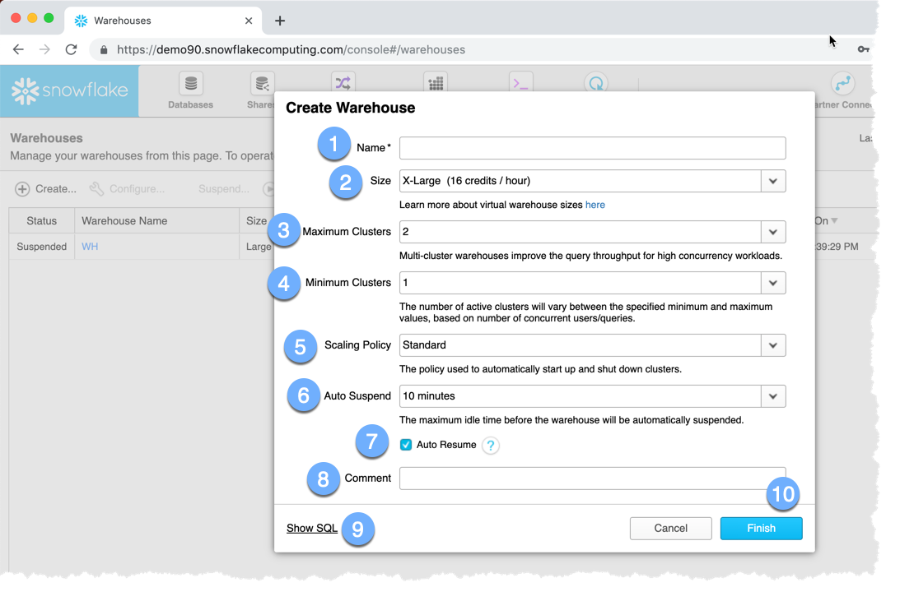
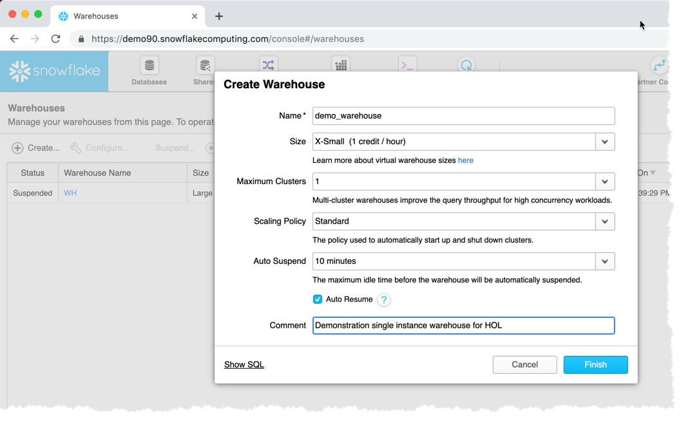
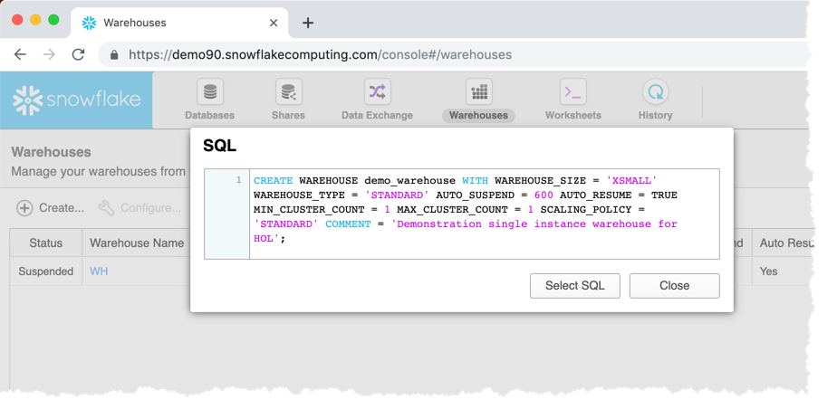
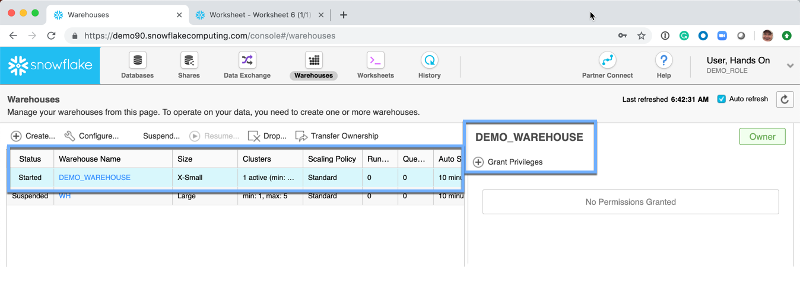
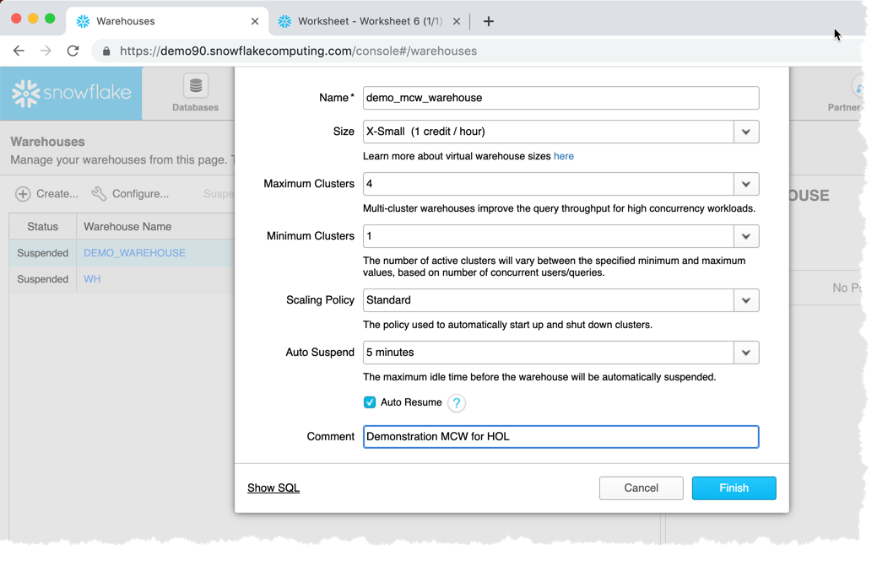
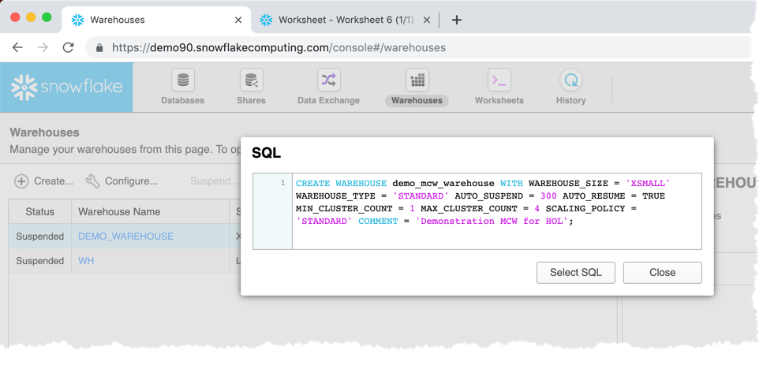
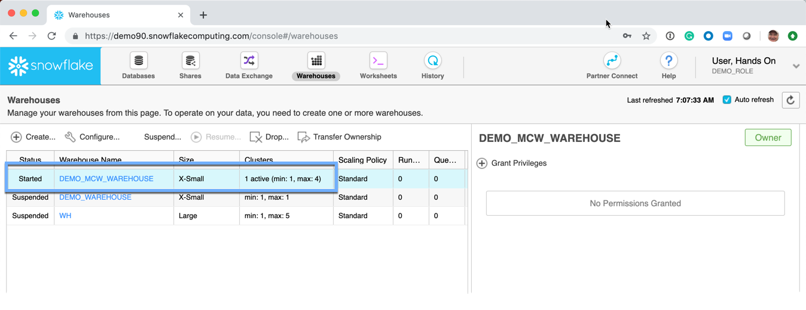
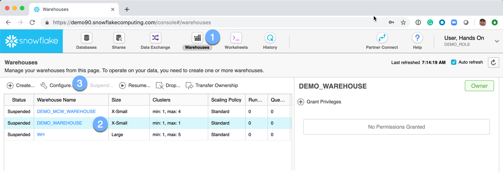
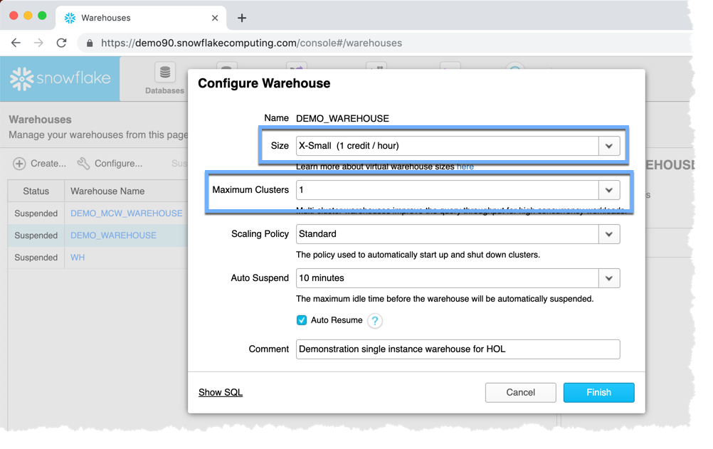
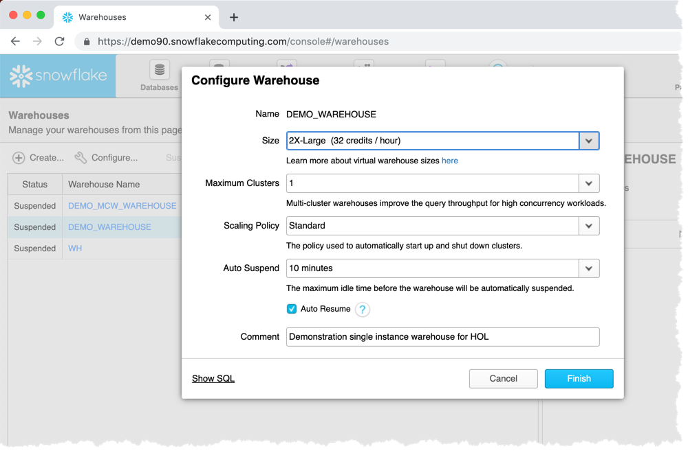

# Snowflake Compute Resources

A virtual warehouse, often referred to simply as a “warehouse”, is a cluster of compute resources in Snowflake. A warehouse provides the required resources, such as CPU, memory, and temporary storage, to perform the following operations in a Snowflake session:

- Executing SQL SELECT statements that require compute resources (e.g. retrieving rows from tables and views).
- Performing DML operations, such as:
  - Updating rows in tables 
  - Loading data into tables 
  - Unloading data from tables 

A warehouse is defined by its size, as well as the other properties that can be set to help control and automate warehouse activity.

Warehouses can be started and stopped at any time. They can also be resized at any time, even while running, to accommodate the need for more or less compute resources, based on the type of operations being performed by the warehouse.

A Warehouse is sized from X-Small to 4X-Large.

Warehouse Size | Cluster Size 
-------------- | ------------
X-Small        | 1
Small          | 2
Medium          | 4
Large          | 8
X-Large          | 16
2X-Large          | 32
3X-Large          | 64
4X-Large          | 128

## Warehouse Auto-Suspension and Auto-Resumption 

A warehouse can be set to automatically resume or suspend, based on activity:

- By default, auto-suspend is enabled. Snowflake automatically suspends the warehouse if it is inactive for the specified period of time.
- By default, auto-resume is enabled. Snowflake automatically resumes the warehouse when any statement that requires a warehouse is submitted and the warehouse is the current warehouse for the session.

These properties can be used to simplify and automate your monitoring and usage of warehouses to match your workload. Auto-suspend ensures that you do not leave a warehouse running (and consuming credits) when there are no incoming queries. Similarly, auto-resume ensures that the warehouse starts up again as soon as it is needed.

## Multi-Cluster Warehouse

A virtual warehouse consist of a single cluster of servers that determines the total resources available to the warehouse for executing queries. As queries are submitted to a warehouse, the warehouse allocates resources to each query and begins executing the queries. If sufficient resources are not available to execute all the queries submitted to the warehouse, Snowflake queues the additional queries until the necessary resources become available.

With multi-cluster warehouses, Snowflake supports allocating, either statically or dynamically, a larger pool of resources to each warehouse. A multi-cluster warehouse is defined by specifying the following properties:

- Maximum number of server clusters, greater than 1 (up to 10).
- Minimum number of server clusters, equal to or less than the maximum (up to 10).

Additionally, multi-cluster warehouses support all the same properties and actions as single-cluster warehouses, including:

- Specifying a warehouse size.
- Resizing a warehouse at any time.
- Auto-suspending a running warehouse due to inactivity; note that this does not apply to individual clusters, but rather the entire warehouse.
- Auto-resuming a suspended warehouse when new queries are submitted.

Any warehouse administration is performed from the **Warehouses** tab.

## Warehouse Creation

The minimum authorization level for manipulating warehouses is *SYSADMIN*. If the creation of the warehouse fails, verify the roles that have been assigned to your account.  The command [SHOW ROLES](https://docs.snowflake.net/manuals/sql-reference/sql/show-roles.html) is useful for listing all the roles for which you have access privileges across your entire account, including the system-defined roles and any custom roles that have been created.

### Single Instance Warehouse

1.  Select the *Warehouses* tab
2.  Select the *Create* link

The *Create Warehouse* dialogue box is displayed.  
1.  **Name:** The name of the warehouse
1.  **Size:** The size of the warehouse.  See the [Warehouse Sizing](#warehouse_size) table for the sizes and number of nodes in a cluster.
1.  **Maximum Clusters:** For a single instance cluster, this is set to 1
1.  **Minimum Clusters:** For a single instance cluster, this option will be removed from the UI when the *maximum cluster* size is set to 1.
1.  **Scaling Policy:** Best practices are for this to remain at *Standard*
1.  **Auto Suspend:** Inactivity time after which the warehouse will be automatically suspended.  The minimum amount of time available through the UI is 5 minutes.  When warehouses are created via the SQL command, the minimum value is 60 seconds.
1.  **Auto Resume:** Check-box which indicates if a suspended warehouse should be auto-restarted upon the first connection.  If this box is not checked, the warehouse will have to be manually started.
1.  **Comment:**  This is an optional meta-data field

1.  **Show SQL:**  This link will show the SQL used to create the warehouse.  **NOTE** Almost every aspect of the Snowflake UI will offer to show the SQL.  This is a great opportunity to learn the commands and helps understand how to interact with Snowflake from the various tools and utilities that are part of the Snowflake ecosystem. 
1.  **Finish:**  Submit the request to have Snowflake create the requested warehouse.

The Warehouses page is redisplayed 
**NOTE:** No permissions have been **GRANT**ed on the table.  Permissions will be discussed in the user security section

### Multi-Cluster Warehouse

The process for creating a Multi-Cluster warehouse is the same as a [single instance warehouse](#single_instance) with one exception:  The values for **Maximum Clusters** and **Minimum Clusters** are different.  For example, the cluster may have a **Maximum Clusters** value of 7 and a **Minimum Clusters** value of 1.  This states that there will always be a minimum of 1 cluster to process incoming requests.  As the workload increases, Snowflake will automatically create additional clusters to handle the increased workload.  As the workload is satisfied, Snowflake will reap the additional clusters, back down to the defined **Minimum Clusters** value.

The Warehouses page is redisplayed 
**NOTE:** No permissions have been **GRANT**ed on the table.  Permissions will be discussed in the user security section

## Dynamiclly Resizing Warehouses

A warehouse can be resized up or down at any time, including while it is running and processing statements.  Resizing a warehouse to a larger size is useful when the operations being performed by the warehouse will benefit from more compute resources, including:

- Improving the performance of large, complex queries against large data sets.
- Improving performance while loading and unloading significant amounts of data.

Resizing a running warehouse adds or removes servers in each cluster in the warehouse. All the usage and credit rules associated with starting or suspending a warehouse apply to resizing a started warehouse, such as:

- Servers added to a warehouse start using credits when they are provisioned; however, the additional servers don’t start executing statements until they are all provisioned, unless some of the servers fail to provision.
- Servers are removed from a warehouse only when the servers are no longer being used to execute any current statements.
Resizing a warehouse doesn’t have any impact on statements that are currently being executed by the warehouse. When resizing to a larger size, the new servers are used only to execute statements that are already in the warehouse queue, as well as all future statements submitted to the warehouse.

### Scaling Up and Down

The process of resizing a warehouse up is:
1.  Select the *Warehouses* tab
1.  Select the warehouse to be dynamically resized
1.  Select the *Configure* tab

The *Configure Warehouse* dialogue box will be presented.

The two configuration parameters which effect the size of the warehouse are **Size** and **Maximum Clusters**.  The **Size** parameters changes the size of the cluster.  See the [Warehouse Sizing](#warehouse_size) table for the sizes and number of nodes in a cluster.  The **Maximum Clusters** parameter either enables or disables MCW for a warehouse.  Setting the value to 1 will disable MCW.  Setting the value to any number greater than 1 will enable MCW, and display the **Minimum Clusters** drop down.

1.  **Show SQL:**  This link will show the SQL used to alter the warehouse.  **NOTE** Almost every aspect of the Snowflake UI will offer to show the SQL.  This is a great opportunity to learn the commands and helps understand how to interact with Snowflake from the various tools and utilities that are part of the Snowflake ecosystem. 
  1.  **Finish:**  Submit the request to have Snowflake alter the requested warehouse.

The Warehouses page is redisplayed 

