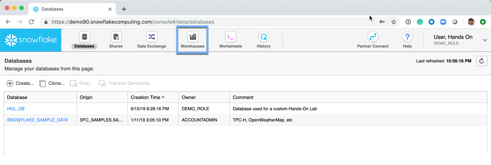
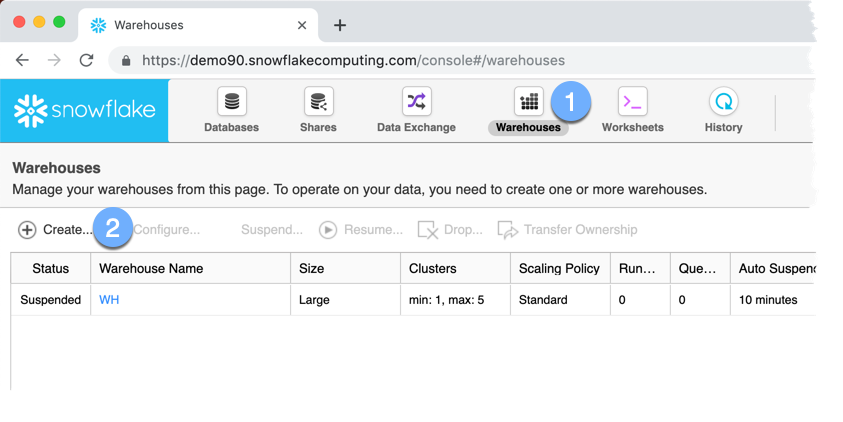

# Snowflake Compute Resources

A virtual warehouse, often referred to simply as a “warehouse”, is a cluster of compute resources in Snowflake. A warehouse provides the required resources, such as CPU, memory, and temporary storage, to perform the following operations in a Snowflake session:

- Executing SQL SELECT statements that require compute resources (e.g. retrieving rows from tables and views).
- Performing DML operations, such as:
  - Updating rows in tables (DELETE , INSERT , UPDATE).
  - Loading data into tables (COPY INTO <table>).
  - Unloading data from tables (COPY INTO <location>).  

A warehouse is defined by its size, as well as the other properties that can be set to help control and automate warehouse activity.

Warehouses can be started and stopped at any time. They can also be resized at any time, even while running, to accommodate the need for more or less compute resources, based on the type of operations being performed by the warehouse.

A Warehouse is sized from X-Small to 4X-Large.

Warehouse Size | Cluster Size 
-------------- | ------------
X-Small        | 1
Small          | 2
Medium          | 4
Large          | 8
X-Large          | 16
2X-Large          | 32
3X-Large          | 64
4X-Large          | 128

## Warehouse Auto-Suspension and Auto-Resumption 

A warehouse can be set to automatically resume or suspend, based on activity:

- By default, auto-suspend is enabled. Snowflake automatically suspends the warehouse if it is inactive for the specified period of time.
- By default, auto-resume is enabled. Snowflake automatically resumes the warehouse when any statement that requires a warehouse is submitted and the warehouse is the current warehouse for the session.

These properties can be used to simplify and automate your monitoring and usage of warehouses to match your workload. Auto-suspend ensures that you do not leave a warehouse running (and consuming credits) when there are no incoming queries. Similarly, auto-resume ensures that the warehouse starts up again as soon as it is needed.

## Multi-Cluster Warehouse

A virtual warehouse consist of a single cluster of servers that determines the total resources available to the warehouse for executing queries. As queries are submitted to a warehouse, the warehouse allocates resources to each query and begins executing the queries. If sufficient resources are not available to execute all the queries submitted to the warehouse, Snowflake queues the additional queries until the necessary resources become available.

With multi-cluster warehouses, Snowflake supports allocating, either statically or dynamically, a larger pool of resources to each warehouse. A multi-cluster warehouse is defined by specifying the following properties:

- Maximum number of server clusters, greater than 1 (up to 10).
- Minimum number of server clusters, equal to or less than the maximum (up to 10).

Additionally, multi-cluster warehouses support all the same properties and actions as single-cluster warehouses, including:

- Specifying a warehouse size.
- Resizing a warehouse at any time.
- Auto-suspending a running warehouse due to inactivity; note that this does not apply to individual clusters, but rather the entire warehouse.
- Auto-resuming a suspended warehouse when new queries are submitted.

Any warehouse administration is performed from the **Warehouses** tab.

## Warehouse Creation

### Single Instance Warehouse

1.  Select the *Warehouses* tab
2.  Select the *Create* link

### Multi-Cluster Warehouse

## Warehouse Maintenance

### Scale Up

### Scale Down
