# Snowflake Data Organization

Snowflake organizes data into a heirarchy of artifcats.  If you are famiiar with heritage RDBMS platforms, these concepts will be familiar.  The **DATABASE** object is at the top level.  A database contains one or more **SCHEMAS**. With in a schema, **TABLES**, **VIEWS**, **FILE FORMATS**, **STAGES**, and **SEQUENCES** are contained.  

This section of the Hands-On Lab will show how to create a:
  * [Database][#Creating a Database]
  * Schema
  * Table
  * View
  * File Format
  * Stage

In order to create these artifacts, navigate to the Databases icon in the Snowflake UI.  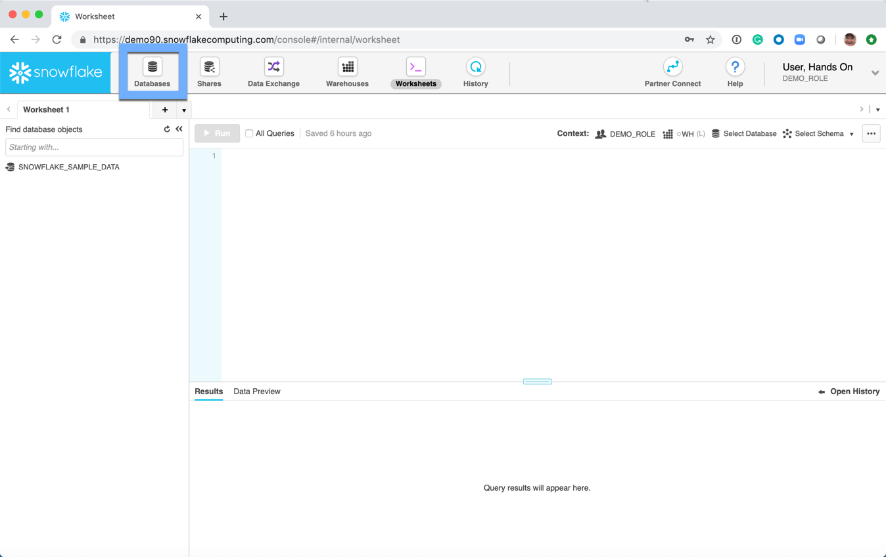

## Creating a Database 
Once the Databases page is presented, choose Create 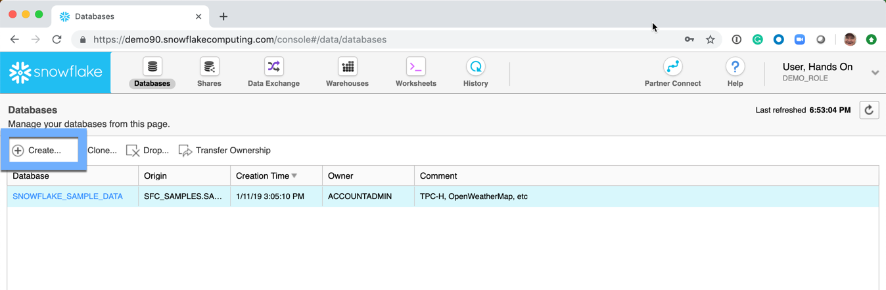

A dialogue box 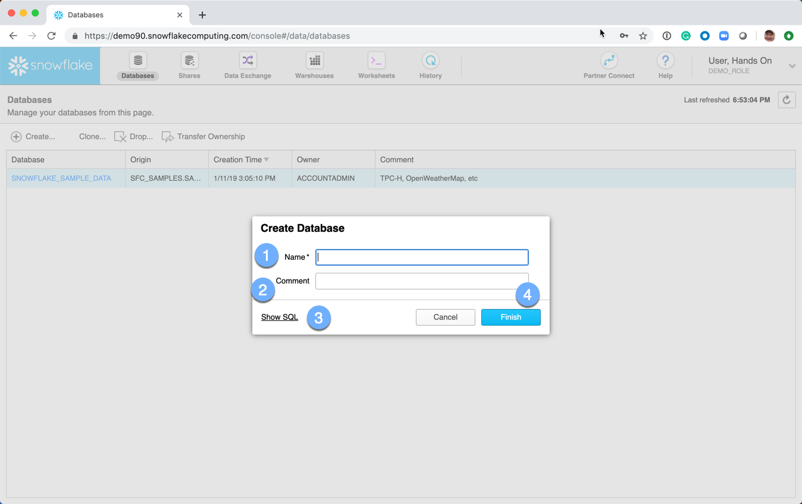 will be presented, and fill out the following information:
  1.  **Name:**  This is the name of the database
  1.  **Comment:**  This is an optional meta-data field 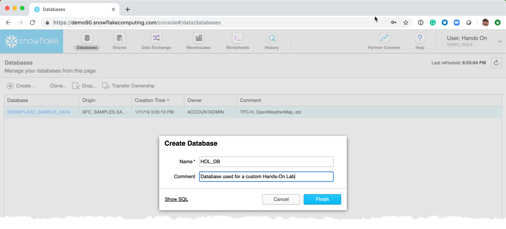
  1.  **Show SQL:**  This link will show the SQL used to create the database.  **NOTE** Almost every aspect of the Snowflake UI will offer to show the SQL.  This is a great opportunity to learn the commands and helps understand how to interact with Snowflake from the various tools and utilities that are part of the Snowflake ecosystem. 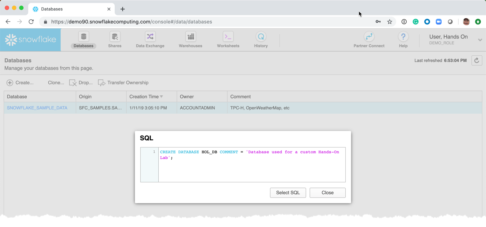
  1.  **Finish:**  Submit the request to have Snowflake create the requested database.  

The Databases page is redisplayed 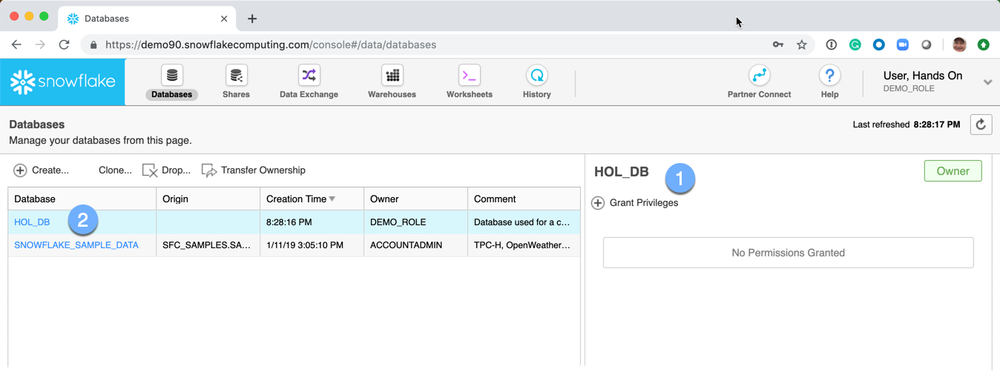
  1.  No permissions have been **GRANT**ed on the database.  Permissions will be discussed in the user security section.
  1.  Click on the database name.  This will drill into the database, and all the sub-artifacts within the database. 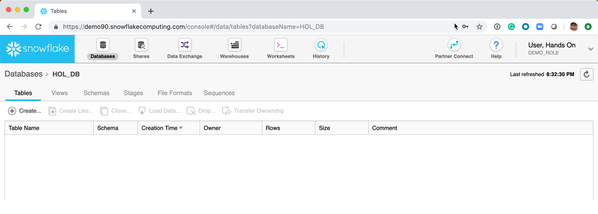

## Creating a Schema
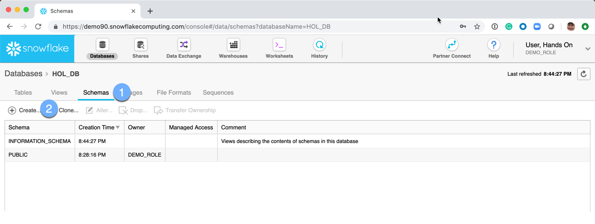
  1.  Click on the **Schemas** tab
  2.  Click on **Create**

A *Create Schema* dialog box is presented: 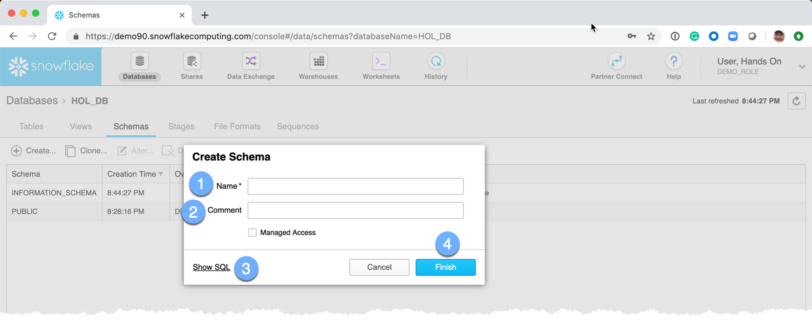
  1.  **Name:** The name of the schema
  1.  **Comment:**  This is an optional meta-data field 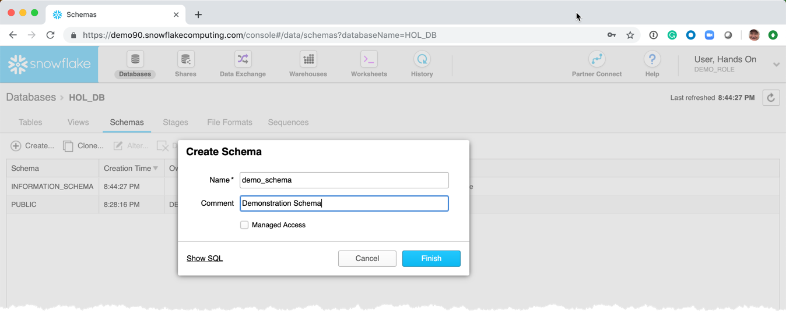
  1.  **Show SQL:**  This link will show the SQL used to create the schema.  **NOTE** Almost every aspect of the Snowflake UI will offer to show the SQL.  This is a great opportunity to learn the commands and helps understand how to interact with Snowflake from the various tools and utilities that are part of the Snowflake ecosystem. 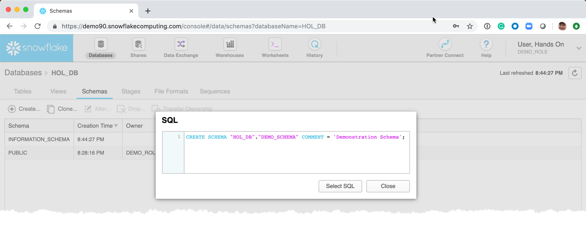
  1.  **Finish:**  Submit the request to have Snowflake create the requested schema.

The Schemas page is redisplayed 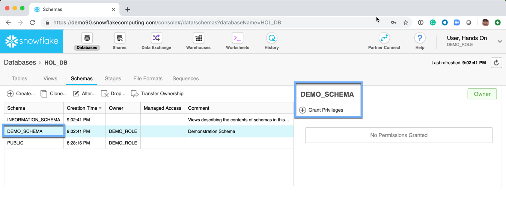
  1.  No permissions have been **GRANT**ed on the schema.  Permissions will be discussed in the user security section.

## Creating a Table
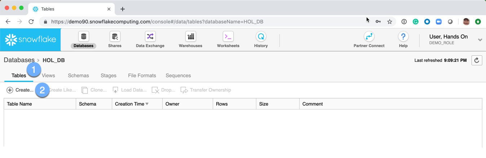
  1.  Click on the **Tables** tab
  2.  Click on **Create**

## Creating a View
## Creating a File Format
## Creating a Stage
