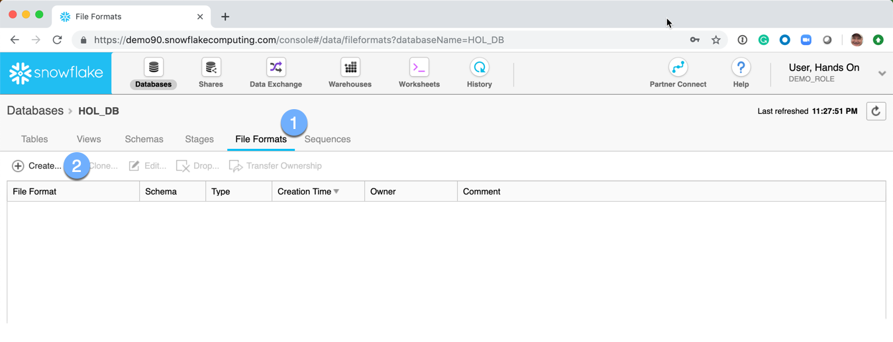
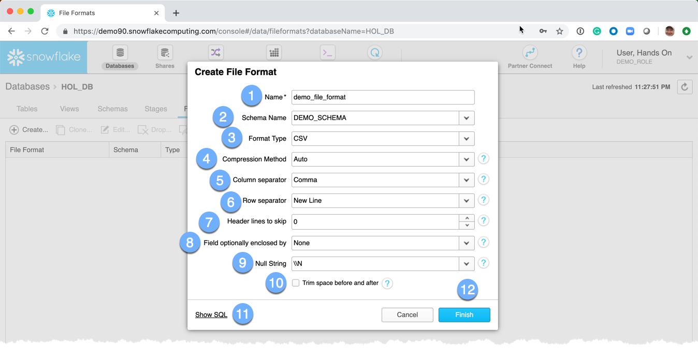
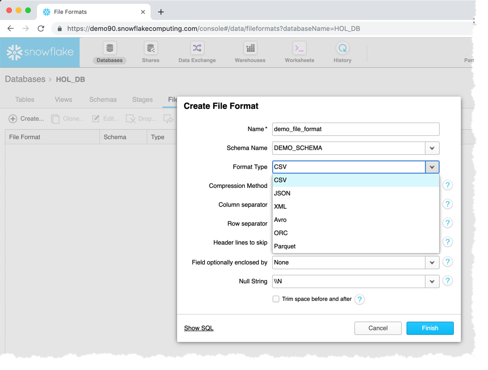
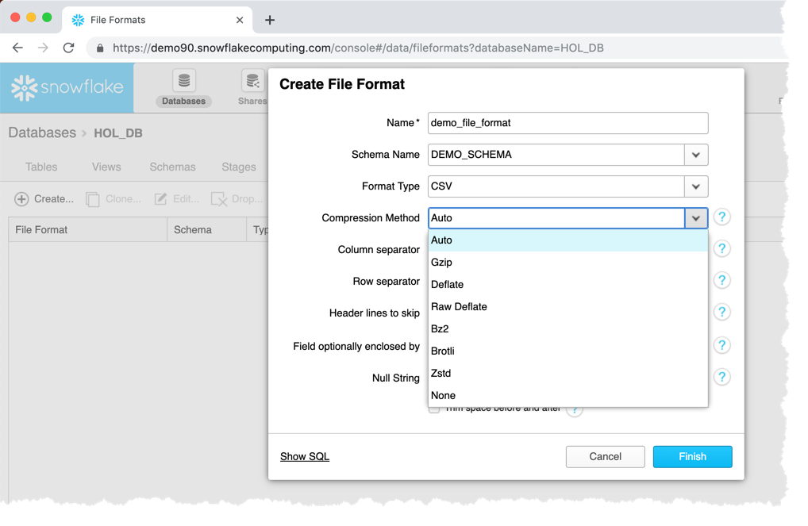
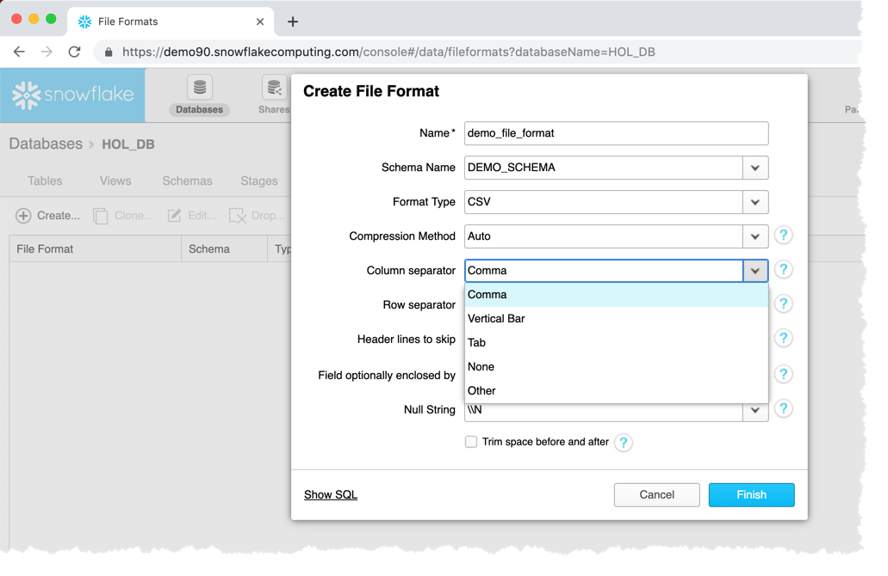
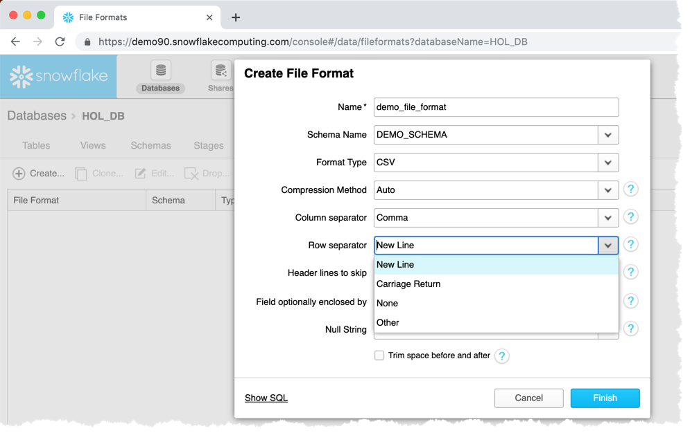
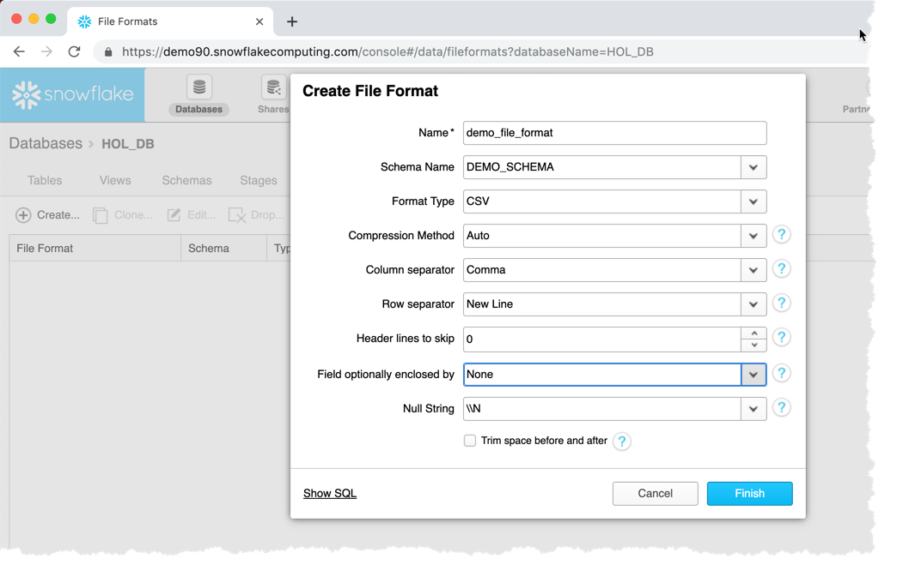
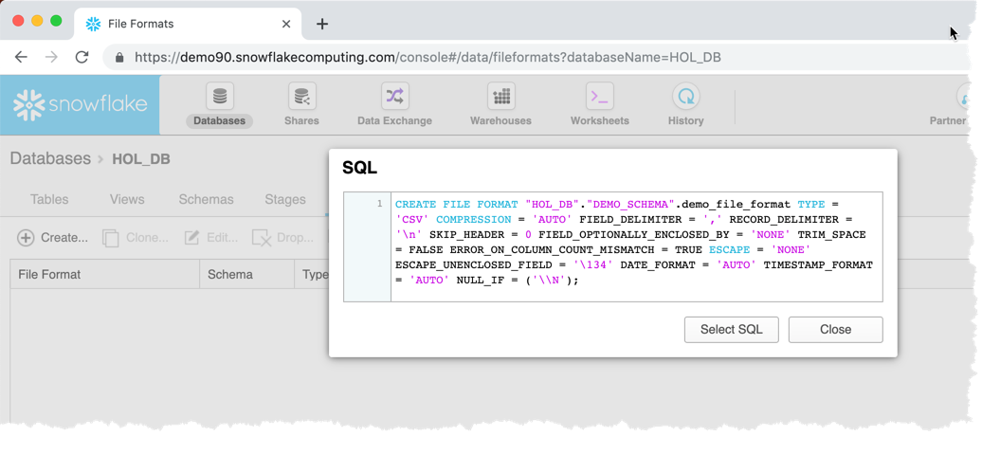
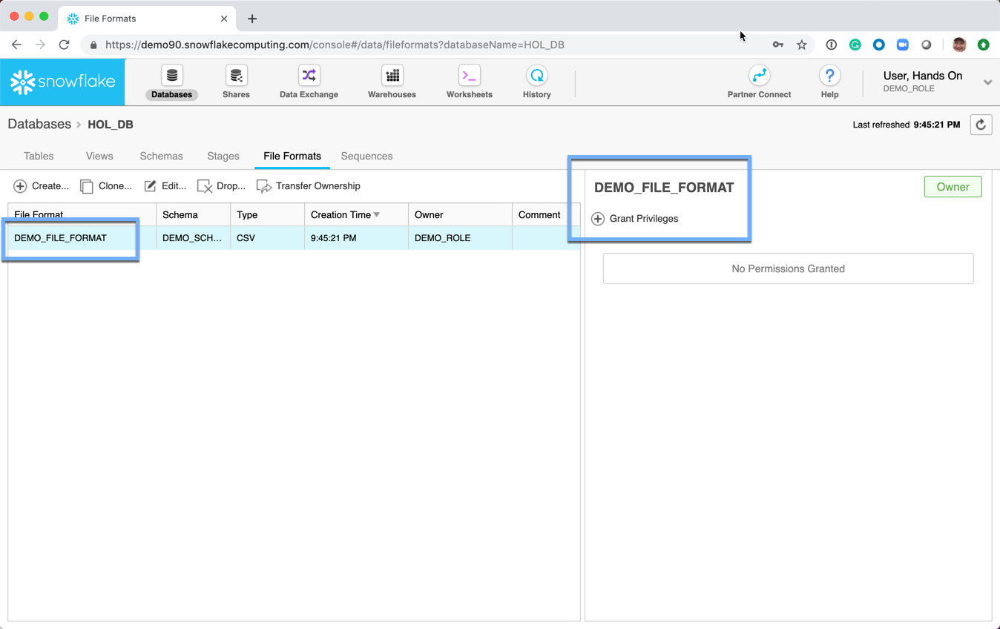

# Creating a File Format
A File Format is used to describe how the data is either read or written during the bulk loading process into|out of Snowflake tables.

  1.  Click on the **File Formats** tab
  2.  Click on **Create**

A *Create File Format* dialog box is presented: 
  1.  **Name:** The name of the file format
  1.  **Schema Name:** The name of the schema.  It is available from the dropdown box.
  1.  **Format Type:** Describes the type of data.  It is available from the dropdown box.
  1.  **Compression Method:** Describes how the data is compressed.  It is available from the dropdown box.
  1.  **Column Separator:** Describes how the columns are delimited.  It is available from the dropdown box.
  1.  **Row Separator:** Describes how the rows are delimited.  It is available from the dropdown box.
  1.  **Header Lines to Skip:**  The number of header lines in the file(s)
  1.  **Fields Optionally Enclosed By:** None, Single and Double Quote 
  1.  **Null String** Describes how NULL values are handles during the ingress and egress process

  1.  **Show SQL:**  This link will show the SQL used to create the file format.  **NOTE** Almost every aspect of the Snowflake UI will offer to show the SQL.  This is a great opportunity to learn the commands and helps understand how to interact with Snowflake from the various tools and utilities that are part of the Snowflake ecosystem. 
  1.  **Finish:**  Submit the request to have Snowflake create the requested file format.

The File Formats page is redisplayed 
**NOTE:** No permissions have been **GRANT**ed on the table.  Permissions will be discussed in the user security section.

