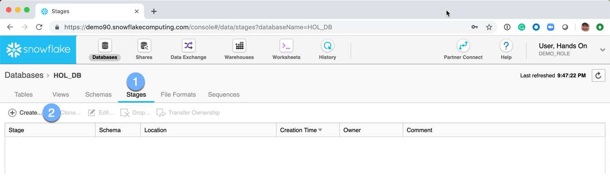
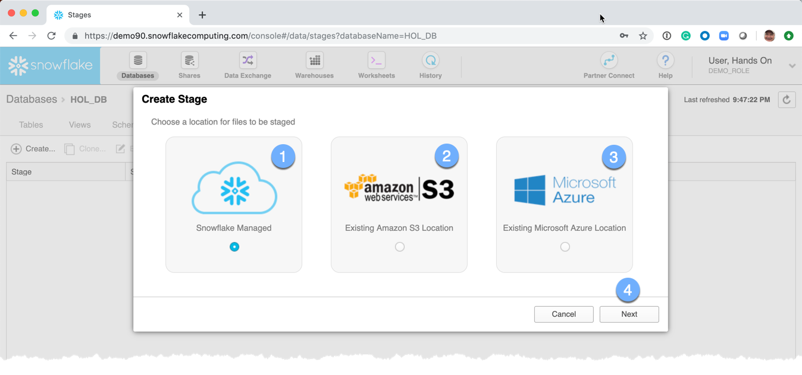
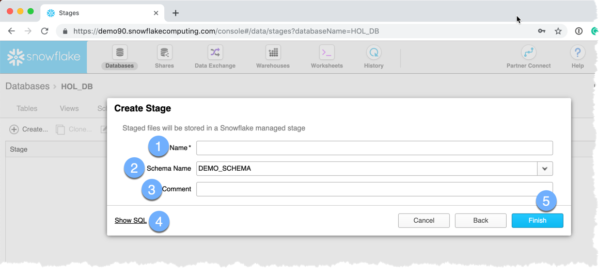
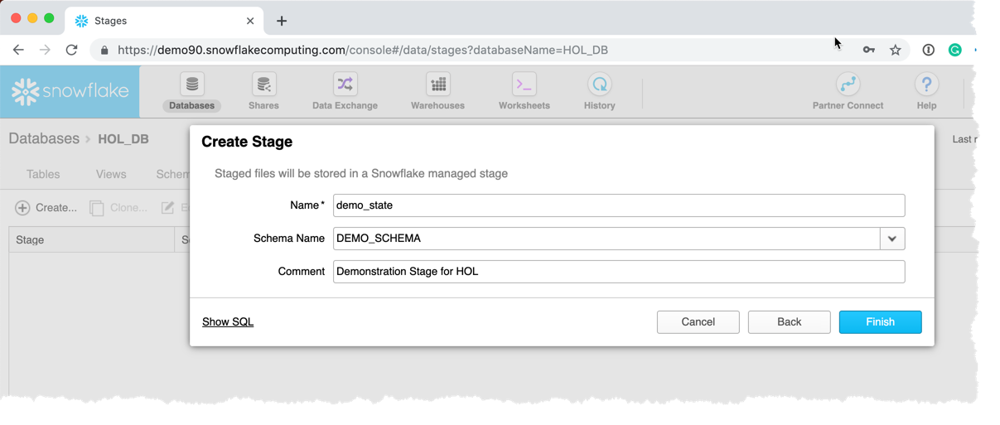
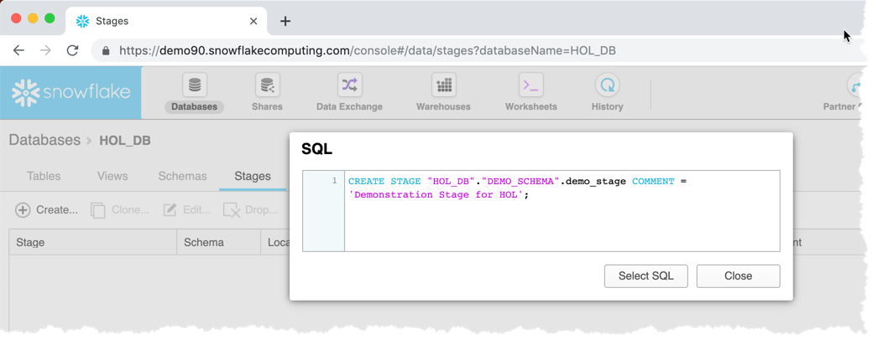
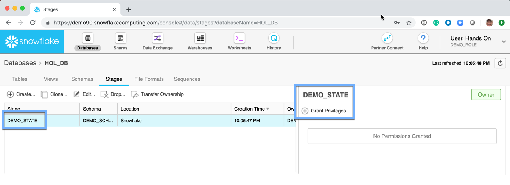

# Creating a Stage

  1.  Click on the **Stages** tab
  2.  Click on **Create**

A *Choose Storage Location* dialog box is presented: 
There are three options to choose from:
  -  Snowflake Managed:  Internal Snowflake managed storage.  This storage is only accessable via GET/PUT commands and COPY INTO <table|location> statements.
  -  AWS S3 Bucket:  Customer managed object storage 
  -  Microsoft Azure Blob:  Customer managed object storage 

**NOTE:** For this example, Internal Snowflake managed storage will be used
  1.  Choose Snowflake Managed
  1.  Choose _Next_

A *Create Stage* dialog box is presented: 

  1.  **Name:** The name of the stage
  1.  **Schema Name:** The name of the schema.  It is available from the dropdown box.
  1.  **Comment:**  This is an optional meta-data field 

  1.  **Show SQL:**  This link will show the SQL used to create the view.  **NOTE** Almost every aspect of the Snowflake UI will offer to show the SQL.  This is a great opportunity to learn the commands and helps understand how to interact with Snowflake from the various tools and utilities that are part of the Snowflake ecosystem. 
  1.  **Finish:**  Submit the request to have Snowflake create the requested view.

The Stages page is redisplayed 
**NOTE:** No permissions have been **GRANT**ed on the table.  Permissions will be discussed in the user security section.

