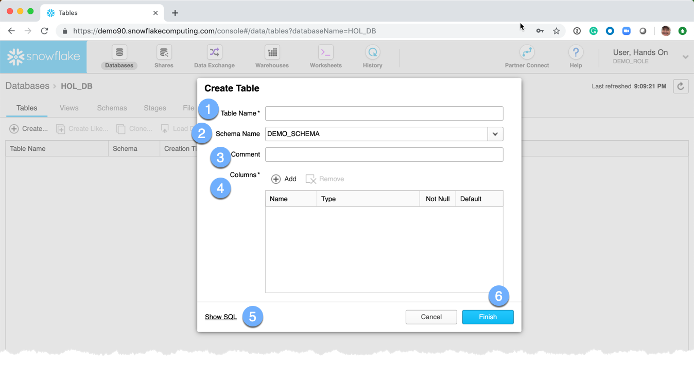
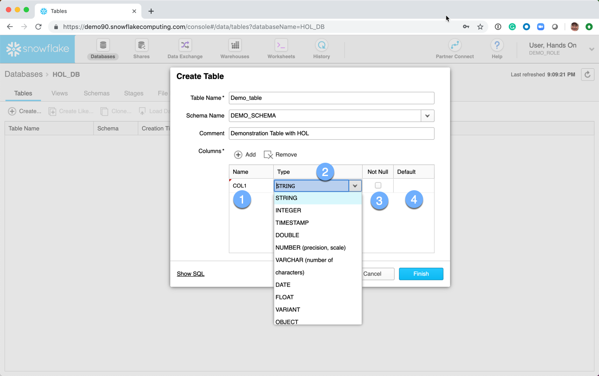
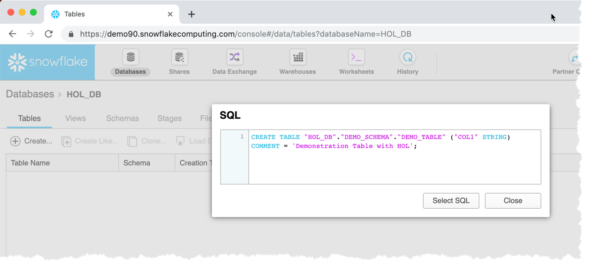
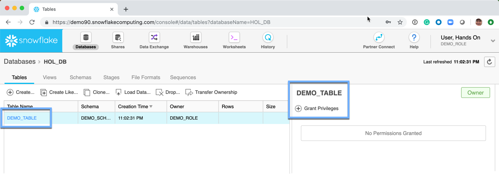

# Creating a Table

  1.  Click on the **Tables** tab
  2.  Click on **Create**

A *Create Table* dialog box is presented: 
  1.  **Name:** The name of the table
  1.  **Schema Name:** The name of the schema.  It is available from the dropdown box.
  1.  **Comment:**  This is an optional meta-data field 
  1.  **Columns:**  A wizard to assist in the creation of columns 
      1.  Enter the name of the column 
      1.  Choose the Data Type from the drop down list
      1.  Choose *NULL* or *NOT NULL*
      1.  Choose a *DEFAULT* value, if any
  1.  **Show SQL:**  This link will show the SQL used to create the table.  **NOTE** Almost every aspect of the Snowflake UI will offer to show the SQL.  This is a great opportunity to learn the commands and helps understand how to interact with Snowflake from the various tools and utilities that are part of the Snowflake ecosystem. 
  1.  **Finish:**  Submit the request to have Snowflake create the requested table.

The Tables page is redisplayed 
**NOTE:** No permissions have been **GRANT**ed on the table.  Permissions will be discussed in the user security section.

[Return to Data Organization](../Data-Organization.md)
