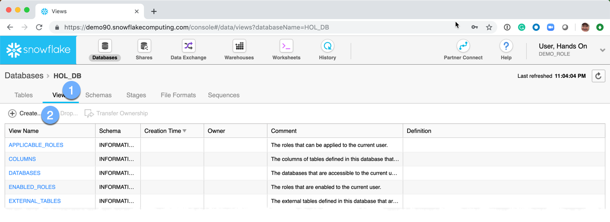
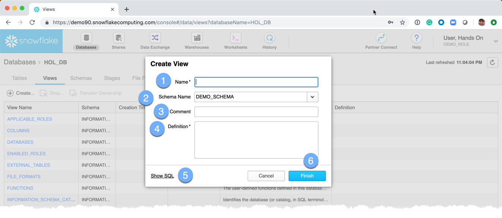
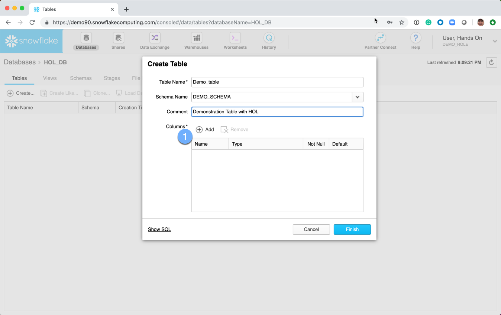
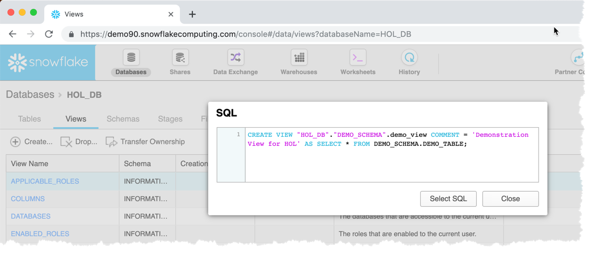
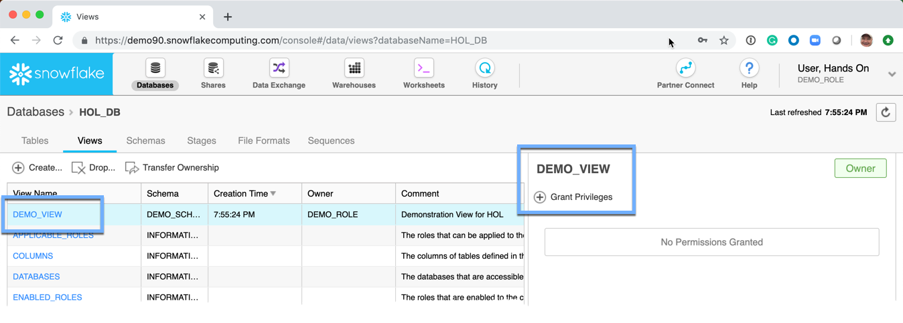

# Creating a View

  1.  Click on the **Views** tab
  2.  Click on **Create**

A *Create View* dialog box is presented: 
  1.  **Name:** The name of the view
  1.  **Schema Name:** The name of the schema.  It is available from the dropdown box.
  1.  **Comment:**  This is an optional meta-data field 
  1.  **Definition** This is the SQL Query that will make up the view 
  1.  **Show SQL:**  This link will show the SQL used to create the view.  **NOTE** Almost every aspect of the Snowflake UI will offer to show the SQL.  This is a great opportunity to learn the commands and helps understand how to interact with Snowflake from the various tools and utilities that are part of the Snowflake ecosystem. 
  1.  **Finish:**  Submit the request to have Snowflake create the requested view.

The Views page is redisplayed 
**NOTE:** No permissions have been **GRANT**ed on the table.  Permissions will be discussed in the user security section.

