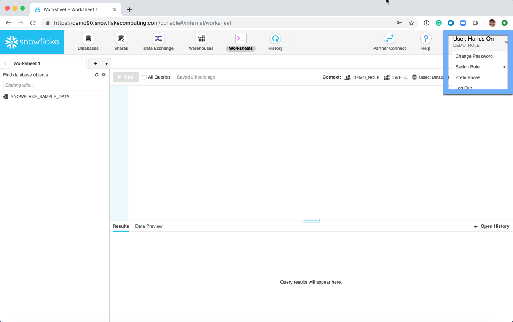

# Snowflake User Interface Overview

**Note** Images|Descriptions accurate as of 15 June 2019.

After the user logs into the URL provided by Snowflake, the following page is presented: 

1. The user context menu.   This is where the user can change their password, switch the role (if multiple roles are assigned), change their Snowflake|User preferences, and logout of the Snowflake service.
1. Databases - This is where all of the data structure artifacts are created.  Examples of these artifacts are:
   - Database
   - Schema
   - Tables
   - Views
   - Stages
   - File Formats
1. Warehouses - This is where the virtual warehouse clusters are created and maintained.
1. Worksheets - SQL worksheets are developed and stored in this tab.
1. History - SQL statement history is found here.  
1. Shares - Secure Data Sharing, both inbound **and** outbound shares are managed in this section of the UI.

**NOTE** Any UI function has a corresponding SQL command.  
