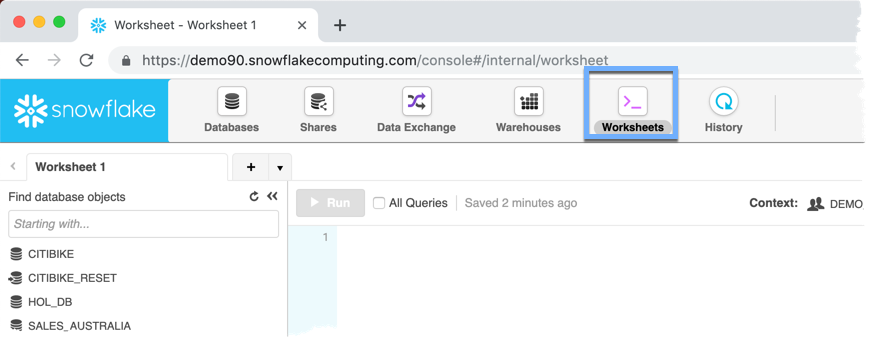
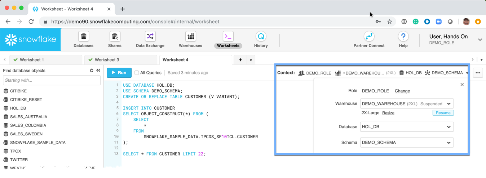
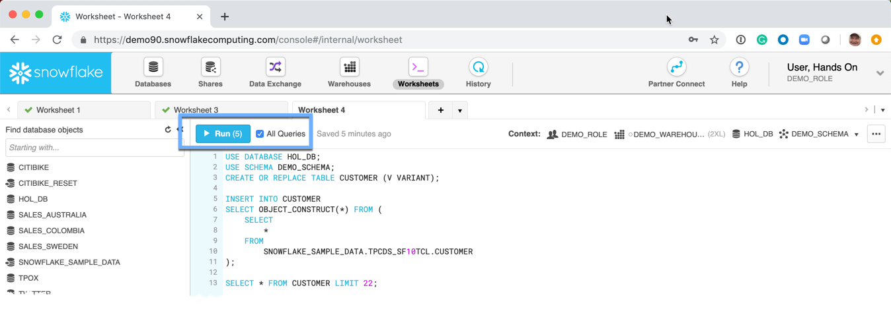

# Query Semi-Structured Data

Snowflake natively supports the storage and querying of:
-  JSON
-  XML
-  Parquet
-  Avro
-  ORC

The workshop will focus on how to convert an existing table into JSON, and how to convert a query using that table into a join between structured and JSON data.

## Convert Tabular to JSON

1.  Navigate to the *Worksheet* tab


1.  Copy the SQL, place it in the worksheet

    **Note:** 65M rows will be used.
    ```
    USE DATABASE HOL_DB;
    USE SCHEMA DEMO_SCHEMA;
    CREATE OR REPLACE TABLE CUSTOMER (V VARIANT);
    
    INSERT INTO CUSTOMER
    SELECT OBJECT_CONSTRUCT(*) FROM (
        SELECT 
            * 
        FROM
            SNOWFLAKE_SAMPLE_DATA.TPCDS_SF10TCL.CUSTOMER
    );

    SELECT * FROM CUSTOMER LIMIT 22;
    ```

    

1.  Set the Context:
    -  DEMO_ROLE
    -  DEMO_WAREHOUSE
    -  HOL_DB
    -  DEMO_SCHEMA
    

1.  Run the SQL
    **Note:** Make sure the *All Queries* checkbox is checked
    


1.  Copy the SQL, place it in the worksheet, and Run the SQL
    ```
    USE DATABASE HOL_DB;
    USE SCHEMA DEMO_SCHEMA;
    with customer_total_return as (
               select 
                   sr_customer_sk as ctr_customer_sk     
                   ,sr_store_sk as ctr_store_sk 
                   ,sum(SR_FEE) as ctr_total_return 
               from 
                   SNOWFLAKE_SAMPLE_DATA.TPCDS_SF10TCL.store_returns 
                   ,SNOWFLAKE_SAMPLE_DATA.TPCDS_SF10TCL.date_dim 
               where 
                   sr_returned_date_sk = d_date_sk 
                   and d_year =2000 
               group by sr_customer_sk ,sr_store_sk)
    select  
        v:C_CUSTOMER_ID as c_customer_id
    from 
        customer_total_return ctr1
        ,SNOWFLAKE_SAMPLE_DATA.TPCDS_SF10TCL.store
        ,customer
    where 
        ctr1.ctr_total_return > (
            select 
                avg(ctr_total_return)*1.2
            from 
                customer_total_return ctr2
            where 
                ctr1.ctr_store_sk = ctr2.ctr_store_sk)
        and s_store_sk = ctr1.ctr_store_sk
        and s_state = 'TN'
        and ctr1.ctr_customer_sk = v:C_CUSTOMER_SK::number
    order by 
        c_customer_id
    limit 22;
    ```
